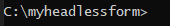

# Maak uw eerste adaptieve vorm zonder koptekst

U kunt adaptieve formulieren zonder Adobe Experience Manager Headless gebruiken om formuliertoepassingen te maken met behulp van front-end UI, zoals React en Forms Web SDK gebruiken voor mogelijkheden zoals staatsbeheer, validatie en integratie met verschillende andere aanraakpunten.

Bijvoorbeeld, kijkt een organisatie We.Org hun reis van de klanteninschrijving te digitaliseren. Hun ontwikkelaars zijn goed verward bij het gebruiken van Angular om frontend oplossingen te bouwen. Ze zijn op zoek naar een aangepaste front-end, waarbij ze de validatie van formulieren en elektronische handtekeningen overdragen aan gespecialiseerde oplossingen.

Adobe Experience Manager Headless-adaptieve formulieren bieden dergelijke organisaties de vrijheid om formulieren te maken met behulp van hun bestaande expertise in frontendtalen en bieden tegelijk ondersteuning voor het gebruik van back-end mogelijkheden om formulieren van ondernemingsklasse te maken.

<!-- >>[!VIDEO](https://video.tv.adobe.com/v/341011/) -->

<!--   -->

## Voordat u begint

* Stel de [ontwikkelomgeving](setup-development-environment.md) om u in staat te stellen een Zwaartepunt - adaptief Vorm op uw lokale machine tot stand te brengen en te testen.
* De volgende software moet op uw lokale ontwikkelcomputer worden geïnstalleerd:
   * [Java Development Kit 11](https://experience.adobe.com/#/downloads/content/software-distribution/en/general.html?1_group.propertyvalues.property=.%2Fjcr%3Acontent%2Fmetadata%2Fdc%3AsoftwareType&amp;1_group.propertyvalues.operation=equals&amp;1_group.propertyvalues.0_values=software-type%3Atooling&amp;fulltext=Oracle%7E+JDK%7E+11%7E&amp;orderby=%40jcr%3Acontent%2 Fjcr%3AlastModified&amp;orderby.sort=desc&amp;layout=list&amp;p.offset=0&amp;p.limit=14)
   * [Laatste release van Git](https://git-scm.com/downloads). Als u nog geen ervaring hebt met Git, raadpleegt u [Git installeren](https://git-scm.com/book/en/v2/Getting-Started-Installing-Git).
   * [Node.js 16.13.0 of hoger](https://nodejs.org/en/download/). Als u nog geen ervaring hebt met Node.js, raadpleegt u [Node.js installeren](https://nodejs.dev/en/learn/how-to-install-nodejs).
   * [Maven 3.6 of hoger](https://maven.apache.org/download.cgi). Als u nog geen ervaring hebt met Maven, zie [Apache Maven installeren](https://maven.apache.org/install.html).


## Gebruik het archetype-project om een Headless adaptief formulier te maken

Het archetype-project is een op maven gebaseerde sjabloon. Het leidt tot een minimaal project dat op beste praktijken wordt gebaseerd om met Headless aanpassings vormen te beginnen. De klasse omvat ook de functie voor het aanpassen van formulieren zonder koptekst voor as a Cloud Service en lokale Forms-ontwikkelomgevingen. Het is verplicht om archetype 37 of later gebaseerd project tot stand te brengen en op te stellen tijdens de bètafase. Na bètabewerking is het project alleen vereist voor aanpassingen.

Voer de volgende stappen uit om uw eerste adaptieve vorm zonder koptekst te maken en weer te geven:

1. [Project maken en implementeren op basis van AEM archetype](#create-an-archetype-based-project)
1. [Implementeer het project in AEM SDK](#deploy-the-project-to-a-local-development-environment)
1. [JSON-schema van Headless adaptive-formulier maken en dit naar uw AEM SDK-instantie uploaden](#create-add-json-representation-of-headless-adaptive-forms)
1. [Een adaptief formulier maken op basis van de sjabloon Blank met kerncomponenten](#create-adaptive-form-with-blank-with-core-components-template)


### 1. Maak en implementeer AEM project op basis van archetype {#create-an-archetype-based-project}

Afhankelijk van het besturingssysteem voert u de onderstaande opdracht uit om een as a Cloud Service Experience Manager Forms-project te maken. Gebruik archetype versie 37 of hoger. Zie, [Archetype-documentatie](https://experienceleague.adobe.com/docs/experience-manager-core-components/using/developing/archetype/overview.html) om de nieuwste versie van Archetype te zoeken.

**Microsoft Windows**

1. Open de bevelherinnering met Administratieve voorrechten (de bevelherinnering van de Looppas of bash shell als beheerder)
1. Voer de onderstaande opdracht uit:

   ```shell
     mvn -B org.apache.maven.plugins:maven-archetype-plugin:3.2.1:generate ^
     -D archetypeGroupId=com.adobe.aem ^
     -D archetypeArtifactId=aem-project-archetype ^
     -D archetypeVersion=37 ^
     -D appTitle=myheadlessform ^
     -D appId=myheadlessform ^
     -D groupId=com.myheadlessform ^
     -D includeFormsenrollment="y" ^
     -D includeFormsheadless="y" 
   ```

   * Set `appTitle` om de titel en componentengroepen te bepalen.
   * Set `appId` om Maven artifactId, de component, config en de namen van de inhoudsomslag, en de cliëntbibliotheeknamen te bepalen.
   * Set `groupId` om Maven groupId en het Bron Pakket van Java te bepalen.
   * Gebruik de `includeFormsenrollment=y` voor Forms-specifieke configuraties, -thema&#39;s, -sjablonen, -kerncomponenten en -afhankelijkheden die vereist zijn voor het maken van een adaptieve Forms.
   * Gebruik de `includeFormsheadless=y` -optie om Forms Core-componenten en afhankelijkheden op te nemen die vereist zijn voor de functionaliteit Headless Adaptive Forms. Als u deze optie inschakelt, worden de volgende opties opgenomen:
      * De **Leeg met kerncomponenten** sjabloon met [kerncomponenten](https://experienceleague.adobe.com/docs/experience-manager-core-components/using/introduction.html?lang=en).
      * een frontend React module, `ui.frontend.react.forms.af`. Hiermee kunt u een hoofdloos adaptief formulier weergeven in een reactie-app.


**Apple macOS of Linux**:

1. Open terminal als wortelgebruiker. Hiermee kunt u opdrachten uitvoeren met beheerdersrechten. U kunt ook `sudo root` bevel na het openen van het eindvenster om bevelen met administratieve voorrechten in werking te stellen.
1. Voer de onderstaande opdracht uit:

   ```shell
     mvn -B org.apache.maven.plugins:maven-archetype-plugin:3.2.1:generate \
     -D archetypeGroupId=com.adobe.aem \
     -D archetypeArtifactId=aem-project-archetype \
     -D archetypeVersion=37 \
     -D appTitle=myheadlessform \
     -D appId=myheadlessform \
     -D groupId=com.myheadlessform \
     -D includeFormsenrollment="y" \
     -D includeFormsheadless="y"  
   ```

   * Set `appTitle` om de titel en componentengroepen te bepalen.
   * Set `appId` om Maven artifactId, de component, config, de namen van de inhoudsomslag, en de cliëntbibliotheek te bepalen.
   * Set `groupId` om Maven groupId en het Bron Pakket van Java te bepalen.
   * Gebruik de `includeFormsenrollment=y` voor Forms-specifieke configuraties, -thema&#39;s, -sjablonen, -kerncomponenten en -afhankelijkheden die vereist zijn voor het maken van een adaptieve Forms.
   * Gebruik de `includeFormsheadless=y` -optie om Forms Core-componenten en afhankelijkheden op te nemen die vereist zijn voor de functionaliteit Headless Adaptive Forms. Als u deze optie inschakelt, worden de volgende opties opgenomen:
      * De **Leeg met kerncomponenten** sjabloon met [kerncomponenten](https://experienceleague.adobe.com/docs/experience-manager-core-components/using/introduction.html?lang=en).
      * Een frontend reactie-module, `ui.frontend.react.forms.af`. Hiermee kunt u een hoofdloos adaptief formulier weergeven in een reactie-app.

Na succesvolle voltooiing van het bevel, een projectomslag met naam die in `appID` wordt gemaakt. Als u bijvoorbeeld `appID` met waarde `myheadlessform`, een map met de naam `myheadlessform` wordt gemaakt. Het bevat het op Archetype gebaseerde project.


### 2. Implementeer het project naar AEM SDK {#deploy-the-project-to-a-local-development-environment}

Wanneer u het project in uw AEM SDK-instantie implementeert, wordt de functie Headless Adaptive Forms toegevoegd, de functie **Leeg met kerncomponenten** sjabloon en andere bronnen die in het project zijn opgenomen naar uw ontwikkelomgeving. <!-- Deploy the project to your local development environment to locally create Headless Adaptive Forms. or deploy directly to your Forms as a Cloud Service environment. !--> Distribueren naar uw AEM SDK-instantie:

1. Opdrachtprompt openen. Als u op Vensters bent, open de bevelherinnering met Administratieve voorrechten (de bevelherinnering van de Looppas of [Schelpschelp van git](https://khushwantsehgal.wordpress.com/2022/06/29/check-if-git-bash-is-running-in-administrator-mode/)  als beheerder).

1. Navigeer naar de projectmap die u in de vorige stap hebt gemaakt. Bijvoorbeeld, `/myheadlessform`

   

1. Voer de volgende opdracht uit:

   ```shell
   mvn -PautoInstallPackage clean install
   ```

   Wacht op het bericht &#39;BUILD SUCCESS&#39;.
   

   Het kan lang duren om de gebiedsdelen op te lossen en het project op te stellen. Als er een mislukking in het opstellen van het project is, zie [problemen oplossen](troubleshooting.md) artikel voor gemeenschappelijke aangelegenheden en de resolutie daarvan .


<!-- *  To learn how to deploy code to AEM as a Cloud Service, see the video in [Deploying to AEM as a Cloud Service]https://experienceleague.adobe.com/docs/experience-manager-cloud-service/content/implementing/deploying/overview.html?lang=en#coding-against-the-right-aem-version) article : -->


### 3. Maak een JSON-schema van een hoofdloos adaptief formulier en upload het naar uw AEM SDK-exemplaar {#create-add-json-representation-of-headless-adaptive-forms}

Een Headless Adaptive Forms wordt weergegeven als een JSON-bestand. U kunt een voorbeeldformulier ophalen van [Winkelboek](https://opensource.adobe.com/aem-forms-af-runtime/storybook/?path=/story/reference-examples--contact) of gebruik het voorbeeldformulier in Archetype Project op `[Archetype Project]\ui.content\src\main\content\jcr_root\content\dam\myheadlessform\af_model_sample.json`. In dit document worden de [inleiding](https://opensource.adobe.com/aem-forms-af-runtime/storybook/?path=/story/reference-examples--introduction) formulier uit Storybook. Het is één veldformulier waarmee u snel aan de slag kunt met Headless Adaptive Forms. <!-- The [specifications](/help/assets/Headless-Adaptive-Form-Specification.pdf) document provides detailed information about various components, rules, and constraints for Headless Adaptive Forms -->

Het schema maken en uploaden:

1. Een tekstbestand zonder opmaak met extensie maken `.json`. Bijvoorbeeld, `myfirstform.json`. U kunt het bestand overal op uw bestandssysteem of in uw op AEM archetype gebaseerde project maken op `\<project-name>\ui.content\src\main\content\jcr_root\content\dam\myheadlessform\<formname>.json`
1. Voeg de volgende JSON-inhoud toe aan uw `.json` en opslaan:

   ```JSON
   {
     "adaptiveform": "0.10.0",
     "items": [
       {
         "fieldType": "text-input",
         "label": {
           "value": "Enter your Name"
         },
         "name": "textInput"
       }
     ],
     "metadata": {
       "grammar": "json-formula-1.0.0",
       "version": "1.0.0"
     }
   }
   ```

   Er wordt één veld toegevoegd aan het formulier:

   

1. Aanmelden bij uw [lokale AEM SDK-instantie](setup-development-environment.md#setup-author-instance)
1. Ga naar Adobe Experience Manager > Forms > Forms en Documents. Tik op Maken > Bestand uploaden.
1. Selecteer de `.json` gemaakt in stap 2 en uploaden. U kunt het Zwaardeloze adaptieve formulier maken. Als u het .json-bestand opslaat in uw op AEM archetype gebaseerd project op `\<project-name>\ui.content\src\main\content\jcr_root\content\dam\myheadlessform\<formname>.json`. U kunt de `mvn -PautoInstallPackage clean install` om het project in te voeren aan uw AEM SDK en `<formname>.json` samen met het .

Als het uploaden van het `.json`ervoor te zorgen dat de [AEM project Archetype is geïmplementeerd](#deploy-the-project-to-a-local-development-environment).

<!-- 1. Open the [contact form](https://opensource.adobe.com/aem-forms-af-runtime/storybook/?path=/story/reference-examples--contact) and tap the [](faq.md#storybook-example) icon on bottom-right side of the Storybook page to view the source code of the headless . 

You can use [Adaptive Forms builder extension for Visual Studio Code](/help/setup-development-environment.md#microsot-visual-studio-code-extension-for-headless-adaptive-forms) to build a JSON schema of your Headless Adaptive Forms. 

You can see [Storybook](https://opensource.adobe.com/aem-forms-af-runtime/storybook/?path=/story/reference-examples--introduction) for sample JSON schemas and list of components, attributes, and properties. You can also see the [specifications document](/help/assets/Headless-Adaptive-Form-Specification.pdf) for detailed information on all the components, constraints, and methods available to define Headless Adaptive Forms.

File extension of a JSON schema of Headless Adaptive Forms is .json. For example, formname.json. Create or add the file to your AEM Archetype based project. For example, `\myheadlessform\ui.content\src\main\content\jcr_root\content\dam\myheadlessform\home-loan.json` -> 

### 3. Deploy the project to a local development environment {#deploy-the-project-to-a-local-development-environment}

You can deploy the project to local development environment. It adds Headless Adaptive Forms functionality, the **Blank with core components** template, JSON schema of form, and other resources included in the project to your development environment. <!-- Deploy the project to your local development environment to locally create Headless Adaptive Forms. or deploy directly to your Forms as a Cloud Service environment. To deploy to your local development environment, use the following command: 

    `mvn -PautoInstallPackage clean install`

If you are on Windows, run the above with Administrative privileges (Run command prompt or [bash shell as an administrator](https://khushwantsehgal.wordpress.com/2022/06/29/check-if-git-bash-is-running-in-administrator-mode/)). For the complete list of commands, see [Building and Installing](https://experienceleague.adobe.com/docs/experience-manager-core-components/using/developing/archetype/using.html?lang=en#building-and-installing).
    
<!-- *  To learn how to deploy code to AEM as a Cloud Service, see the video in [Deploying to AEM as a Cloud Service]https://experienceleague.adobe.com/docs/experience-manager-cloud-service/content/implementing/deploying/overview.html?lang=en#coding-against-the-right-aem-version) article : -->

### 4. Maak een adaptief formulier op basis van de sjabloon Blank met kerncomponenten {#create-adaptive-form-with-blank-with-core-components-template}

1. Aanmelden bij uw [AEM SDK-instantie](http://localhost:4502/).

1. Ga naar Adobe Experience Manager > Forms > Forms en Documents.

1. Tik op Maken en selecteer Adaptief formulier. Selecteer de **Leeg met kerncomponenten** sjabloon en tik op Maken.

   

1. Geef de waarden op voor de volgende eigenschapvelden. De velden Titel en Naam zijn verplicht:

   * **Titel**: Hiermee geeft u de weergavenaam van het formulier op. Met de titel kunt u het formulier identificeren in de gebruikersinterface van Experience Manager Forms.
   * **Naam**: Hiermee geeft u de naam van het formulier op. Er wordt een knooppunt met de opgegeven naam gemaakt in de repository. Wanneer u een titel begint te typen, wordt automatisch een waarde voor het naamveld gegenereerd. U kunt de voorgestelde waarde wijzigen. Het naamveld mag alleen alfanumerieke tekens, afbreekstreepjes en onderstrepingstekens bevatten. Alle ongeldige invoer wordt vervangen door een afbreekstreepje.

1. Tik op Maken. Er wordt een adaptief formulier gemaakt.

Als u het geneesmiddel niet ziet **Leeg met kerncomponenten** de [AEM project Archetype is geïmplementeerd](#deploy-the-project-to-a-local-development-environment).

### 5. Configureer het adaptieve formulier voor gebruik van het JSON-schema {#configure-adaptive-form-to-use-the-JSON-representation}

Het adaptieve formulier dat in de vorige stap is gemaakt, is leeg. Configureer het adaptieve formulier voor gebruik van het JSON-schema:

1. Aanmelden bij uw [AEM SDK-instantie](http://localhost:4502/).

1. Ga naar Adobe Experience Manager > Forms > Forms en Documents. Selecteer het adaptieve formulier dat u in de vorige stap hebt gemaakt en tik op Bewerken. Het adaptieve formulier wordt geopend in de editor.

1. Tik op de component Adaptive Forms Container en Tik op Eigenschappen. De eigenschappencontrole wordt weergegeven in de zijbalk.

1. Vouw in de eigenschappenverkenner de BASIC-accordeon uit en geef het pad op van het JSON-schema dat in een vorige stap is geüpload voor de optie Documentpad bij uitvoering van Forms. De containercomponent geeft een uitvoering van het formulier weer.

1. Vouw in de eigenschappenverkenner de accordeon SUBMISSION uit en stel een handeling Verzenden in voor het adaptieve formulier. Uw formulier kan worden gebruikt in een app voor reageren.

1. Als u het formulier wilt weergeven, wordt het gehost op uw lokale ontwikkelcomputer:

   1. Open de `[Archetype project]\ui.frontend.react.forms.af\.env` en het formulierpad instellen. Bijvoorbeeld /content/forms/af/contact

   1. Open de opdrachtprompt en navigeer naar het project ui.frontend.response.forms.af en voer de volgende opdracht uit:

      `npm run start`

   1. Na het invullen opent u de localhost:3000 in uw browservenster om het weergegeven Headless Adaptive Form weer te geven.
   1. Als u de verzendfunctionaliteit wilt testen, meldt u zich aan bij uw AEM Forms-server en gebruikt u de opdracht **Een voorbeeld van het formulier weergeven in HTML** Hiermee opent u het formulier in de voorbeeldmodus.

De [Winkelboek](https://opensource.adobe.com/aem-forms-af-runtime/storybook/) Bevat een lijst met componenten en regels die op verschillende Headless Adaptive Forms kunnen worden ingesteld, samen met een voorbeeld van het JSON-schema van Headless Adaptive Forms. U kunt ook [specificaties](/help/assets/Headless-Adaptive-Form-Specification.pdf) voor meer informatie over de verschillende regels en eigenschappen van Headless Adaptive Forms.
