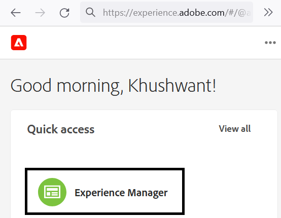
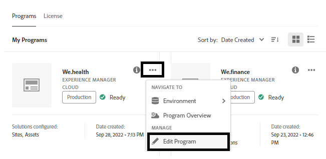

# Ontwikkelomgeving instellen voor hulpformulieren zonder hoofd op Cloud Service

<span class="preview"> Dit artikel is a **WERK IN VOORTGANG**.</span>


Klaar om adaptieve formulieren voor Headless te bouwen en te testen op Cloud Service? Schakel Forms in voor uw Cloud Service-programma en ga aan de slag.

## Voordat u begint

* Installeer de [ Meest recente versie van Git ](https://git-scm.com/downloads) op uw lokale machine. Als u aan Git nieuw bent, zie [ Installerend Git ](https://git-scm.com/book/en/v2/Getting-Started-Installing-Git). Met de Git-opslagplaats kunt u formulieren en aangepaste code die in uw lokale ontwikkelomgeving zijn ontwikkeld, naar uw Cloud Service-ontwikkelomgeving verzenden.

* Installeer [ Node.js 16.13.0 of later ](https://nodejs.org/en/download/) op uw lokale machine. <!-- URL IS 404! If you are new to Node.js, see [How to install Node.js](https://nodejs.org/en/learn/how-to-install-nodejs). -->


* Creeer een programma van AEM as a Cloud Service: Volg stap 1-7 van [ creeer programma ](https://experienceleague.adobe.com/en/docs/experience-manager-cloud-service/content/onboarding/demo-add-on/create-program#create-program) artikel om een programma voor uw organisatie tot stand te brengen.

* Laat het [ Kanaal van de preRelease voor uw programma van Cloud Service ](https://experienceleague.adobe.com/en/docs/experience-manager-cloud-service/content/release-notes/prerelease#cloud-environments) toe.

## Workflow instellen

Schakel `Forms - Digital enrolment` -oplossing in voor uw AEM Cloud Service-programma om Zwaarloze adaptieve formulieren in te schakelen op uw Forms as a Cloud Service-sandbox. Maak vervolgens een project Archetype 37 of hoger op uw lokale computer en duw het naar uw Forms as a Cloud Service-omgeving. Het volledige proces is:


### &#x200B;1. Forms inschakelen voor uw programma

<table style="table-layout:auto">
<tr>
  <td>
  1. Meld u aan bij <a href="https://experience.adobe.com/" > https://experience.adobe.com/ </a> en selecteer de optie <b> Experience Manager </b> .

  </td>
  <td>
    <a href="https://experienceleague.adobe.com/en/docs/experience-manager-cloud-service/content/onboarding/demo-add-on/create-program#create-program">
      
    </a>
    <br>
  </td>
</tr>
<tr>
  <td>
  &#x200B;2. Voor de optie <b> Cloud Manager </b> klikt u op <b> Starten. </b> Er wordt een lijst met programma's voor uw organisatie weergegeven.
  </td>
  <td>
    <a href="https://experienceleague.adobe.com/en/docs/experience-manager-cloud-service/content/onboarding/demo-add-on/create-program#create-program">
      
    </a>
    <br>
  </td>
</tr>
<tr>
  <td>
    &#x200B;3. Tik voor uw programma op het pictogram ... en selecteer de optie <b> Programma bewerken </b> . Er wordt een dialoogvenster weergegeven. 
  </td>
  <td>
    <a href="https://experienceleague.adobe.com/en/docs/experience-manager-cloud-service/content/onboarding/demo-add-on/create-program#create-program">
      
    </a>
    <br>
  </td>
</tr>
<tr>
  <td>
    &#x200B;4. Ga in het dialoogvenster Programma bewerken naar het tabblad <b> Oplossingen en invoegtoepassingen </b> , selecteer de optie <b> Forms - Digital Enrollment </b> en tik op <b> Bijwerken </b> . 
  </td>
  <td>
    <a href="https://experienceleague.adobe.com/en/docs/experience-manager-cloud-service/content/onboarding/demo-add-on/create-program#create-program">
      
    </a>
    <br>
  </td>
</tr>
</table>

### &#x200B;2. Kloont de Git-opslagplaats van uw programma naar uw lokale computer

Elk AEM as a Cloud Service-programma heeft een Git-opslagplaats. Hiermee kunt u aangepaste code en elementen van een lokale computer uploaden naar uw Cloud Service-omgeving. Tijdens de installatie gebruikt Adobe de Git-opslagplaats om code, sjablonen en andere informatie die betrekking hebben op uw Cloud Service-programma, zonder koptekst, van uw lokale computer te voorzien. Het klonen van de Cloud Service Git-opslagplaats op uw lokale computer is de eerste stap naar het plaatsen van aangepaste code en inhoud van uw lokale computer naar Cloud Service.

>[!INFO]
>
> U kunt zich altijd vastleggen op een Git-opslagplaats zonder deze te klonen. Maar het heeft zijn eigen eigenaardigheden. Dit document zal dus de klonen-benadering gebruiken.


De gegevensopslagruimte klonen:

<table style="table-layout:fixed">
<tr>
  <td>
  1. Tik in het pijplijnvak van uw programma op <b> Toegang tot repo-info. </b> Er verschijnt een dialoogvenster met informatie over opslagplaats 

  </td>
  <td>
    <a href="https://experienceleague.adobe.com/en/docs/experience-manager-cloud-service/content/onboarding/demo-add-on/create-program#create-program">
      
    </a>
    <br>
  </td>
</tr>
<tr>
  <td>
  &#x200B;2. Tik op <b> Wachtwoord genereren </b> en kopieer de URL van de <b> gegevensopslagruimte. </b> 
  </td>
  <td>
      
    <br>
  </td>
</tr>
<tr>
  <td>
    &#x200B;3. Open op uw lokale computer de opdrachtregel, maak een map en voer de volgende opdracht uit. Geef vervolgens de gewenste gegevens op voor de bewaarplaats:
    </br>
    <code> git clone [Repository URL] </code> </br></br>
    Bijvoorbeeld: </br> 
    <code> git clone https://git.cloudmanager.adobe.com/stage-aemformsdev/khushwantsingh-p45413-uk89613/ </code>

</br> wanneer gevraagd, krijg <b> Gebruikersnaam </b> en <b> Wachtwoord </b> van het <b> scherm van Info van de Bewaarplaats </b>.
</td>
  <td>
     
  </td>
</tr>
</table>


### &#x200B;3. Een project op basis van AEM Archetype maken

Het archetype-project is een op maven gebaseerde sjabloon. Het leidt tot een minimaal project dat op beste praktijken wordt gebaseerd om met Headless aanpassings vormen te beginnen. Het omvat ook de kernfuncties voor het aanpassen van formulieren zonder koptekst voor Forms as a Cloud Service. Het is verplicht om het archetype 37 of later gebaseerde project tot stand te brengen en op te stellen.
®®
Afhankelijk van het besturingssysteem voert u de opdracht maven uit om een Experience Manager Forms as a Cloud Service-project te maken. Gebruik archetype versie 37 of hoger. Zie {de documentatie van 0} Archetype [ om de recentste versie van Archetype te vinden.](https://experienceleague.adobe.com/en/docs/experience-manager-core-components/using/developing/archetype/overview)

+++ Microsoft® Windows

1. Open de bevelherinnering met Administratieve voorrechten (de bevelherinnering van de Looppas of bash shell als beheerder).
1. Voer de onderstaande opdracht uit:

   ```shell
     mvn -B org.apache.maven.plugins:maven-archetype-plugin:3.2.1:generate ^
     -D archetypeGroupId=com.adobe.aem ^
     -D archetypeArtifactId=aem-project-archetype ^
     -D archetypeVersion=37 ^
     -D appTitle=myheadlessform ^
     -D appId=myheadlessform ^
     -D groupId=com.myheadlessform ^
     -D includeFormsenrollment="y" ^
     -D includeFormsheadless="y" 
   ```

™™

* Stel `appTitle` in om de titel en de groepen componenten te definiëren.
* Stel `appId` in om de namen van de componenten, config en inhoudsmappen en de clientbibliotheek te definiëren.
* Stel `groupId` in om de Maven GroupId en het Java™ Source-pakket te definiëren.
* Met de optie `includeFormsenrollment=y` kunt u specifieke Forms-configuraties, -thema&#39;s, -sjablonen, -kerncomponenten en -afhankelijkheden opnemen die vereist zijn om een adaptieve Forms te maken.
* Met de optie `includeFormsheadless=y` kunt u Forms Core-componenten en afhankelijkheden opnemen die vereist zijn om de functionaliteit voor Zwaardeloze adaptieve formulieren te kunnen gebruiken. Als u deze optie inschakelt, worden de volgende opties opgenomen:
   * **Leeg met kerncomponenten** malplaatje met [ kerncomponenten ](https://experienceleague.adobe.com/en/docs/experience-manager-core-components/using/introduction).
   * A frontend React module, `ui.frontend.react.forms.af`. Hiermee kunt u een adaptieve vorm zonder koptekst weergeven in een reactie-app.

+++®®


+++ Apple macOS of Linux®

1. Open de terminal als een hoofdgebruiker. Hiermee kunt u opdrachten uitvoeren met beheerdersrechten. U kunt ook de opdracht `sudo root` gebruiken nadat u het terminalvenster hebt geopend om opdrachten met beheerdersrechten uit te voeren.
1. Voer de onderstaande opdracht uit:

   ```shell
     mvn -B org.apache.maven.plugins:maven-archetype-plugin:3.2.1:generate \
     -D archetypeGroupId=com.adobe.aem \
     -D archetypeArtifactId=aem-project-archetype \
     -D archetypeVersion=37 \
     -D appTitle=myheadlessform \
     -D appId=myheadlessform \
     -D groupId=com.myheadlessform \
     -D includeFormsenrollment="y" \
     -D includeFormsheadless="y"  
   ```

™™
* Stel `appTitle` in om de titel en de groepen componenten te definiëren.
* Stel `appId` in om de namen van MavenArtId, de component, config, de inhoudsmap en de clientbibliotheek te definiëren.
* Stel `groupId` in om de Maven GroupId en het Java™ Source-pakket te definiëren.
* Met de optie `includeFormsenrollment=y` kunt u specifieke Forms-configuraties, -thema&#39;s, -sjablonen, -kerncomponenten en -afhankelijkheden opnemen die vereist zijn om een adaptieve Forms te maken.
* Met de optie `includeFormsheadless=y` kunt u Forms Core-componenten en afhankelijkheden opnemen die vereist zijn om de functionaliteit voor Zwaardeloze adaptieve formulieren te kunnen gebruiken. Als u deze optie inschakelt, worden de volgende opties opgenomen:
   * **Leeg met kerncomponenten** malplaatje met [ kerncomponenten ](https://experienceleague.adobe.com/en/docs/experience-manager-core-components/using/introduction).
   * Een frontend reageert module, `ui.frontend.react.forms.af`. Hiermee kunt u een adaptieve vorm zonder koptekst weergeven in een reactie-app.

+++

Als de opdracht met succes is voltooid, wordt een projectmap gemaakt met de naam die in `appID` is opgegeven. Als u bijvoorbeeld `appID` met value `myheadlessform` gebruikt, wordt een map met de naam `myheadlessform` gemaakt. Het bevat het op Archetype gebaseerde project.

### &#x200B;4. Zet het AEM Archetype-project in uw Cloud Service-omgeving

1. Vervang de inhoud van de Git-opslagplaats door inhoud van een op Archtype gebaseerd project.

   >[!VIDEO](https://video.tv.adobe.com/v/3409809/)

1. Open de opdrachtprompt, navigeer naar de map van de Git-opslagplaats en voer de onderstaande opdrachten in de vermelde volgorde uit om de vervangen inhoud te uploaden naar uw Cloud Service-omgeving. U kunt ook een visuele editor gebruiken in plaats van de onderstaande opdrachten om inhoud naar de Cloud Service-opslagplaats te verzenden.

   ```
      git add .
      git commit
      git push origin
   ```

### &#x200B;5. Stel een bouwstijlpijpleiding voor uw programma in werking


<table style="table-layout:auto">
<tr>
  <td>
  1. Meld u aan bij <a href="https://experience.adobe.com/" > https://experience.adobe.com/ </a> en selecteer de optie <b> Experience Manager </b> .

  </td>
  <td>
    <a href="https://experienceleague.adobe.com/en/docs/experience-manager-cloud-service/content/onboarding/demo-add-on/create-program#create-program">
      
    </a>
    <br>
  </td>
</tr>
<tr>
  <td>
  &#x200B;2. Voor de optie <b> Cloud Manager </b> klikt u op <b> Starten. </b> Er wordt een lijst met programma's voor uw organisatie weergegeven. Open uw programma. 
  </td>
  <td>
    <a href="https://experienceleague.adobe.com/en/docs/experience-manager-cloud-service/content/onboarding/demo-add-on/create-program#create-program">
      
    </a>
    <br>
  </td>
</tr>
<tr>
  <td>
    &#x200B;3. Tik voor de pijplijn op het pictogram ... en selecteer de optie <b> Uitvoeren </b> . Tik op <b> Uitvoeren </b> en wacht tot de status van de <b> pijplijn </b> verandert in <b> Voltooid </b> als u wordt gevraagd om de pijplijn uit te voeren.  
  </td>
  <td>
    <a href="https://experienceleague.adobe.com/en/docs/experience-manager-cloud-service/content/onboarding/demo-add-on/create-program#create-program">
      
    </a>
    <br>
  </td>
</tr>
</table>

Nu is uw omgeving klaar voor gebruik van hulpformulieren zonder koptekst. U kunt nu een JSON-definitie van een formulier uploaden naar uw Cloud Service-omgeving. Dan, creeer een Hoofdloze adaptieve vorm die op het wordt gebaseerd, en gebruik [ getForm ](https://opensource.adobe.com/aem-forms-af-runtime/api/#tag/Get-Form-Definition/operation/getForm) en andere rest APIs om de Zwaarteloze adaptieve vorm in uw toepassing of dienst te gebruiken.
